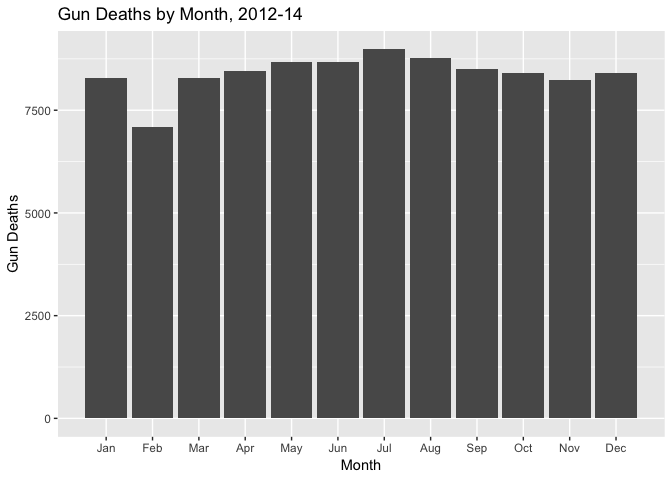
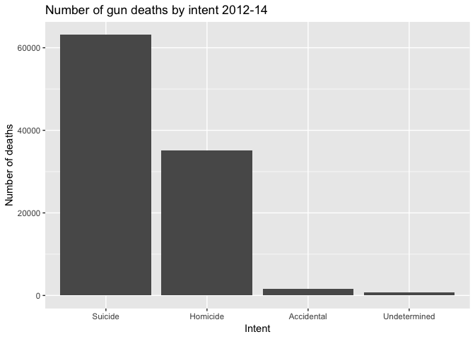
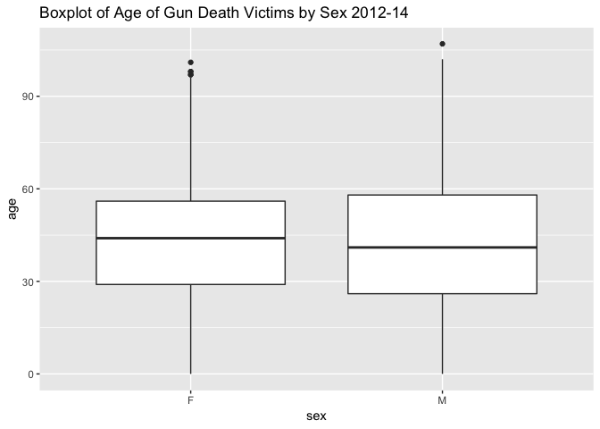
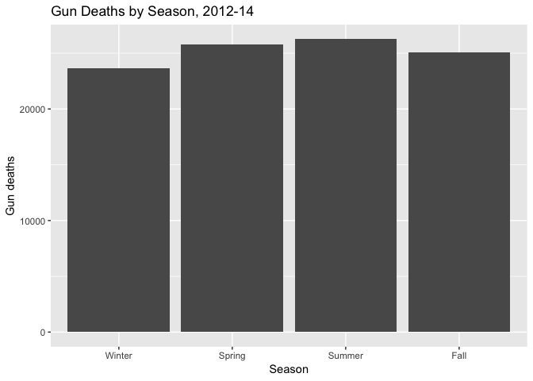
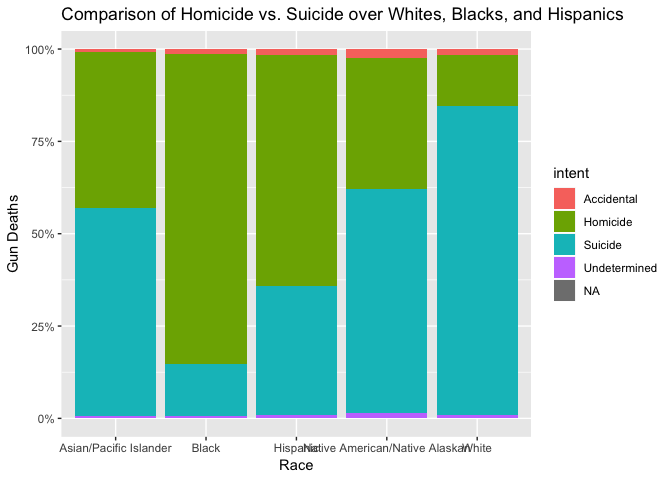
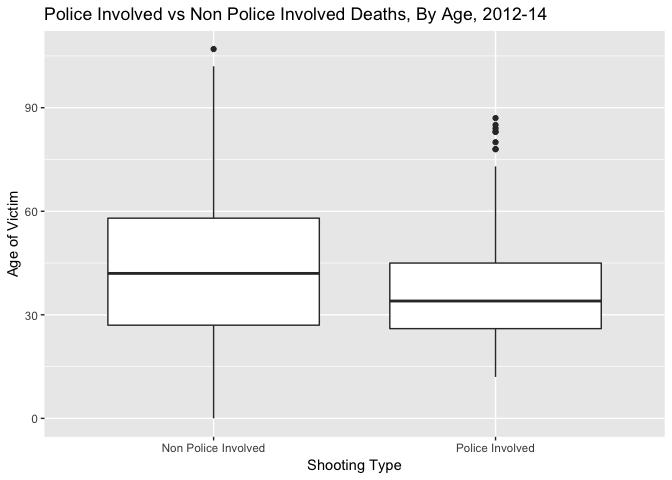
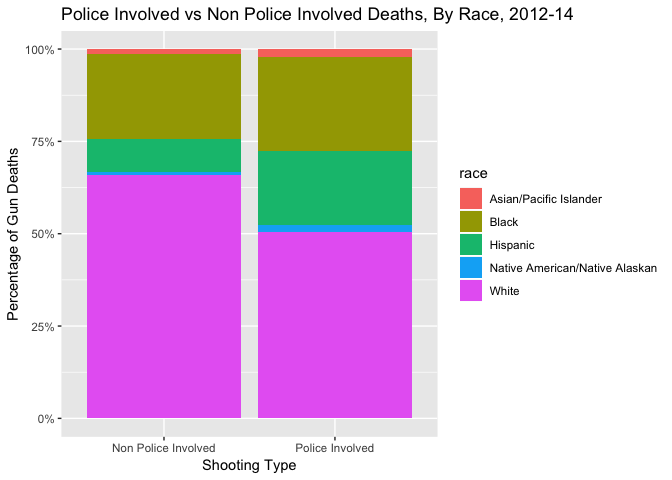
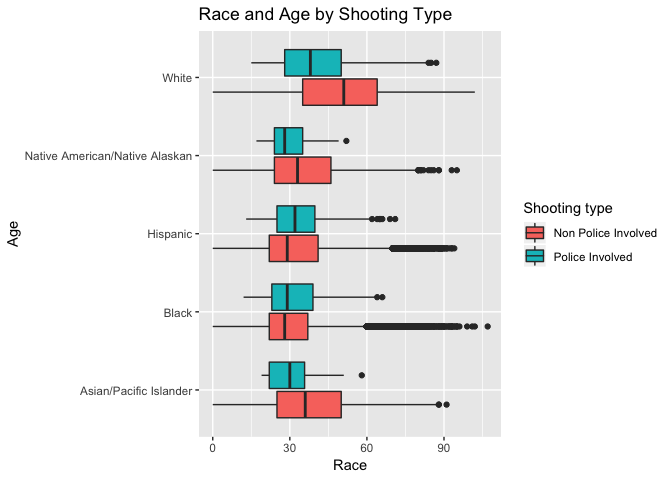
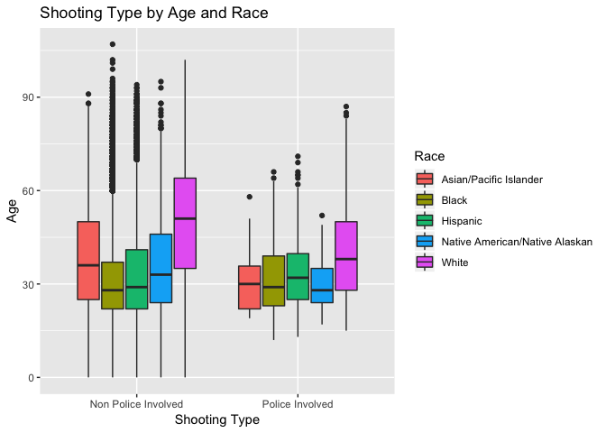

Exploring Gun Deaths in America
================
Abigail Bergman

Get the data
------------

``` r
# don't modify this chunk unless you still need to install rcfss
# if so, run "devtools::install_github("uc-cfss/rcfss")" in the console first

library(tidyverse)    # load tidyverse packages, including ggplot2 
```

    ## ── Attaching packages ─────────────────────────────────────── tidyverse 1.2.1 ──

    ## ✔ ggplot2 3.0.0     ✔ purrr   0.2.5
    ## ✔ tibble  1.4.2     ✔ dplyr   0.7.6
    ## ✔ tidyr   0.8.1     ✔ stringr 1.3.1
    ## ✔ readr   1.1.1     ✔ forcats 0.3.0

    ## ── Conflicts ────────────────────────────────────────── tidyverse_conflicts() ──
    ## ✖ dplyr::filter() masks stats::filter()
    ## ✖ dplyr::lag()    masks stats::lag()

``` r
library(rcfss)

# load the data
data("gun_deaths")
gun_deaths
```

    ## # A tibble: 100,798 x 10
    ##       id  year month intent  police sex     age race      place  education
    ##    <int> <int> <dbl> <chr>    <int> <chr> <int> <chr>     <chr>  <fct>    
    ##  1     1  2012     1 Suicide      0 M        34 Asian/Pa… Home   BA+      
    ##  2     2  2012     1 Suicide      0 F        21 White     Street Some col…
    ##  3     3  2012     1 Suicide      0 M        60 White     Other… BA+      
    ##  4     4  2012     2 Suicide      0 M        64 White     Home   BA+      
    ##  5     5  2012     2 Suicide      0 M        31 White     Other… HS/GED   
    ##  6     6  2012     2 Suicide      0 M        17 Native A… Home   Less tha…
    ##  7     7  2012     2 Undete…      0 M        48 White     Home   HS/GED   
    ##  8     8  2012     3 Suicide      0 M        41 Native A… Home   HS/GED   
    ##  9     9  2012     2 Accide…      0 M        50 White     Other… Some col…
    ## 10    10  2012     2 Suicide      0 M        NA Black     Home   <NA>     
    ## # ... with 100,788 more rows

Generate a data frame that summarizes the number of gun deaths per month.
-------------------------------------------------------------------------

``` r
library(tidyverse)
library(knitr)
library(rcfss)

count(gun_deaths, month) 
```

    ## # A tibble: 12 x 2
    ##    month     n
    ##    <dbl> <int>
    ##  1     1  8273
    ##  2     2  7093
    ##  3     3  8289
    ##  4     4  8455
    ##  5     5  8669
    ##  6     6  8677
    ##  7     7  8989
    ##  8     8  8783
    ##  9     9  8508
    ## 10    10  8406
    ## 11    11  8243
    ## 12    12  8413

### Print the data frame as a formatted `kable()` table.

``` r
(month_count <- count(gun_deaths, month) %>%
kable(caption = "Gun Deaths in the US from 2012-14, shown by month", col.names = c("Month","Number of Gun Deaths")))
```

|  Month|  Number of Gun Deaths|
|------:|---------------------:|
|      1|                  8273|
|      2|                  7093|
|      3|                  8289|
|      4|                  8455|
|      5|                  8669|
|      6|                  8677|
|      7|                  8989|
|      8|                  8783|
|      9|                  8508|
|     10|                  8406|
|     11|                  8243|
|     12|                  8413|

### Generate a bar chart with human-readable labels on the x-axis. That is, each month should be labeled "Jan", "Feb", "Mar" (full or abbreviated month names are fine), not `1`, `2`, `3`.

``` r
#Rename months 

(by_month <- gun_deaths %>%
  drop_na(month) %>%
  ggplot(aes(x=month)) +geom_bar()) + labs(title="Gun Deaths by Month, 2012-14", x = "Month", y = "Gun Deaths") + scale_x_discrete(limits = c("1","2","3","4","5","6","7","8","9","10","11","12"), labels = c("Jan", "Feb", "Mar", "Apr", "May", "Jun", "Jul", "Aug", "Sep", "Oct", "Nov", "Dec"))
```



Generate a bar chart that identifies the number of gun deaths associated with each type of intent cause of death. The bars should be sorted from highest to lowest values.
--------------------------------------------------------------------------------------------------------------------------------------------------------------------------

``` r
#make new data frame reordering 
(n_intent <- gun_deaths %>%
  drop_na(intent) %>%
  count(intent))
```

    ## # A tibble: 4 x 2
    ##   intent           n
    ##   <chr>        <int>
    ## 1 Accidental    1639
    ## 2 Homicide     35176
    ## 3 Suicide      63175
    ## 4 Undetermined   807

``` r
#make column chart
  ggplot(n_intent, aes(x=reorder(intent, -n), y = n)) + geom_col() + labs(title = "Number of gun deaths by intent 2012-14", x = "Intent", y = "Number of deaths") 
```



Generate a boxplot visualizing the age of gun death victims, by sex. Print the average age of female gun death victims.
-----------------------------------------------------------------------------------------------------------------------

``` r
#make boxplot
gun_deaths %>%
  ggplot(aes(x=sex, y =age)) +
  geom_boxplot() + labs(title = "Boxplot of Age of Gun Death Victims by Sex 2012-14")
```

    ## Warning: Removed 18 rows containing non-finite values (stat_boxplot).



``` r
#print female average

group_by(gun_deaths, sex)%>%
  filter(sex == "F") %>%
  summarize(avg_age = mean(age, na.rm=TRUE))
```

    ## # A tibble: 1 x 2
    ##   sex   avg_age
    ##   <chr>   <dbl>
    ## 1 F        43.7

``` r
print("Female Average = 43.69507")
```

    ## [1] "Female Average = 43.69507"

How many white males with at least a high school education were killed by guns in 2012?
---------------------------------------------------------------------------------------

``` r
filter(gun_deaths, year== 2012, sex =="M", race == "White") %>%
  group_by(education) %>%
  count()
```

    ## # A tibble: 5 x 2
    ## # Groups:   education [5]
    ##   education        n
    ##   <fct>        <int>
    ## 1 Less than HS  2858
    ## 2 HS/GED        7912
    ## 3 Some college  4258
    ## 4 BA+           3029
    ## 5 <NA>           285

``` r
total <- (7912+4258+3029)

print("15199 whites males with at least a high school education were killed by guns in 2012")
```

    ## [1] "15199 whites males with at least a high school education were killed by guns in 2012"

Which season of the year has the most gun deaths?
-------------------------------------------------

Assume that:

-   Winter = January-March
-   Spring = April-June
-   Summer = July-September
-   Fall = October-December

``` r
# convert continuous to categorical
(season <- gun_deaths%>% 
  mutate(Season=cut(month, breaks=c("0", "3", "6", "9", "12"), labels=c("Winter","Spring","Summer", "Fall"))) %>%
  group_by(Season) %>%
   count())
```

    ## # A tibble: 4 x 2
    ## # Groups:   Season [4]
    ##   Season     n
    ##   <fct>  <int>
    ## 1 Winter 23655
    ## 2 Spring 25801
    ## 3 Summer 26280
    ## 4 Fall   25062

``` r
ggplot(season, aes(x=Season, y=n)) + geom_col() + labs(title = "Gun Deaths by Season, 2012-14", y = "Gun deaths") 
```



``` r
print("Summer had the most gun deaths with 26280")
```

    ## [1] "Summer had the most gun deaths with 26280"

Are whites who are killed by guns more likely to die because of suicide or homicide? How does this compare to blacks and hispanics?
===================================================================================================================================

``` r
#Better graph
(likely_all <- gun_deaths %>%
  group_by(race, intent) %>%
  count())
```

    ## # A tibble: 21 x 3
    ## # Groups:   race, intent [21]
    ##    race                   intent           n
    ##    <chr>                  <chr>        <int>
    ##  1 Asian/Pacific Islander Accidental      12
    ##  2 Asian/Pacific Islander Homicide       559
    ##  3 Asian/Pacific Islander Suicide        745
    ##  4 Asian/Pacific Islander Undetermined    10
    ##  5 Black                  Accidental     328
    ##  6 Black                  Homicide     19510
    ##  7 Black                  Suicide       3332
    ##  8 Black                  Undetermined   126
    ##  9 Hispanic               Accidental     145
    ## 10 Hispanic               Homicide      5634
    ## # ... with 11 more rows

``` r
ggplot(likely_all, aes(x = race, y = n, fill = intent)) + geom_col(position = "fill") + labs(title = "Comparison of Homicide vs. Suicide over Whites, Blacks, and Hispanics", x = "Race", y = "Gun Deaths") + scale_y_continuous(labels = scales::percent)
```



``` r
print("Whites are more likely to die from suicide, Blacks are more likely to die from homicide, Hispanics are more likely to die from homicide")
```

    ## [1] "Whites are more likely to die from suicide, Blacks are more likely to die from homicide, Hispanics are more likely to die from homicide"

Are police-involved gun deaths significantly different from other gun deaths? Assess the relationship between police involvement and age, police involvement and race, and the intersection of all three variables.
-------------------------------------------------------------------------------------------------------------------------------------------------------------------------------------------------------------------

``` r
#make a table showing number of gun deaths associated with police and not associated with police

gun <- gun_deaths %>%
  mutate(bypolice = ifelse(police %in% 0, "Non Police Involved","Police Involved"))
 
gun %>%
  group_by(bypolice)%>%
  count()
```

    ## # A tibble: 2 x 2
    ## # Groups:   bypolice [2]
    ##   bypolice                n
    ##   <chr>               <int>
    ## 1 Non Police Involved 99396
    ## 2 Police Involved      1402

``` r
print("There are 99396 non police involved gun deaths and 1402 police involved gun deaths")
```

    ## [1] "There are 99396 non police involved gun deaths and 1402 police involved gun deaths"

``` r
#gun deaths and age
ggplot(gun, aes(x=bypolice, y = age)) + geom_boxplot() + labs(title = "Police Involved vs Non Police Involved Deaths, By Age, 2012-14", y = "Age of Victim", x = "Shooting Type")
```

    ## Warning: Removed 18 rows containing non-finite values (stat_boxplot).



``` r
#comparison by race

(race_police <- gun %>%
  group_by(race, bypolice) %>%
  count())
```

    ## # A tibble: 10 x 3
    ## # Groups:   race, bypolice [10]
    ##    race                           bypolice                n
    ##    <chr>                          <chr>               <int>
    ##  1 Asian/Pacific Islander         Non Police Involved  1296
    ##  2 Asian/Pacific Islander         Police Involved        30
    ##  3 Black                          Non Police Involved 22940
    ##  4 Black                          Police Involved       356
    ##  5 Hispanic                       Non Police Involved  8740
    ##  6 Hispanic                       Police Involved       282
    ##  7 Native American/Native Alaskan Non Police Involved   892
    ##  8 Native American/Native Alaskan Police Involved        25
    ##  9 White                          Non Police Involved 65528
    ## 10 White                          Police Involved       709

``` r
ggplot(race_police, aes(x = bypolice, y = n, fill = race)) + geom_col(position = "fill") + labs(title = "Police Involved vs Non Police Involved Deaths, By Race, 2012-14", y = "Percentage of Gun Deaths", x = "Shooting Type") + scale_y_continuous(labels = scales::percent)
```



``` r
                                                                      #All three variables

ggplot(gun, aes(x=race, y = age)) + geom_boxplot(aes( fill = bypolice)) + coord_flip() + guides(fill = guide_legend(title = "Shooting type")) + labs(title = "Race and Age by Shooting Type", x = "Age", y = "Race")
```

    ## Warning: Removed 18 rows containing non-finite values (stat_boxplot).



``` r
ggplot(gun, aes(x=bypolice, y = age)) + geom_boxplot(aes( fill = race)) + guides(fill = guide_legend(title = "Race")) + labs(x = "Shooting Type", y = "Age", title = "Shooting Type by Age and Race")
```

    ## Warning: Removed 18 rows containing non-finite values (stat_boxplot).



Session info
------------

``` r
# don't modify this chunk
devtools::session_info()
```

    ## Session info -------------------------------------------------------------

    ##  setting  value                       
    ##  version  R version 3.3.3 (2017-03-06)
    ##  system   x86_64, darwin13.4.0        
    ##  ui       X11                         
    ##  language (EN)                        
    ##  collate  en_US.UTF-8                 
    ##  tz       America/Chicago             
    ##  date     2018-10-14

    ## Packages -----------------------------------------------------------------

    ##  package    * version date       source                        
    ##  assertthat   0.2.0   2017-04-11 CRAN (R 3.3.2)                
    ##  backports    1.1.2   2017-12-13 CRAN (R 3.3.2)                
    ##  base       * 3.3.3   2017-03-07 local                         
    ##  bindr        0.1.1   2018-03-13 CRAN (R 3.3.3)                
    ##  bindrcpp   * 0.2.2   2018-03-29 CRAN (R 3.3.3)                
    ##  broom        0.5.0   2018-07-17 CRAN (R 3.3.3)                
    ##  cellranger   1.1.0   2016-07-27 CRAN (R 3.3.0)                
    ##  cli          1.0.1   2018-09-25 CRAN (R 3.3.3)                
    ##  colorspace   1.3-2   2016-12-14 CRAN (R 3.3.2)                
    ##  crayon       1.3.4   2017-09-16 CRAN (R 3.3.2)                
    ##  datasets   * 3.3.3   2017-03-07 local                         
    ##  devtools     1.13.6  2018-06-27 CRAN (R 3.3.3)                
    ##  digest       0.6.17  2018-09-12 CRAN (R 3.3.3)                
    ##  dplyr      * 0.7.6   2018-06-29 CRAN (R 3.3.3)                
    ##  evaluate     0.11    2018-07-17 CRAN (R 3.3.3)                
    ##  fansi        0.3.0   2018-08-13 CRAN (R 3.3.3)                
    ##  forcats    * 0.3.0   2018-02-19 CRAN (R 3.3.3)                
    ##  ggplot2    * 3.0.0   2018-07-03 CRAN (R 3.3.3)                
    ##  glue         1.3.0   2018-07-17 CRAN (R 3.3.3)                
    ##  graphics   * 3.3.3   2017-03-07 local                         
    ##  grDevices  * 3.3.3   2017-03-07 local                         
    ##  grid         3.3.3   2017-03-07 local                         
    ##  gtable       0.2.0   2016-02-26 CRAN (R 3.3.0)                
    ##  haven        1.1.2   2018-06-27 CRAN (R 3.3.3)                
    ##  highr        0.7     2018-06-09 CRAN (R 3.3.3)                
    ##  hms          0.4.2   2018-03-10 CRAN (R 3.3.3)                
    ##  htmltools    0.3.6   2017-04-28 CRAN (R 3.3.2)                
    ##  httr         1.3.1   2017-08-20 CRAN (R 3.3.2)                
    ##  jsonlite     1.5     2017-06-01 CRAN (R 3.3.2)                
    ##  knitr      * 1.20    2018-02-20 CRAN (R 3.3.3)                
    ##  labeling     0.3     2014-08-23 CRAN (R 3.3.0)                
    ##  lattice      0.20-34 2016-09-06 CRAN (R 3.3.3)                
    ##  lazyeval     0.2.1   2017-10-29 CRAN (R 3.3.2)                
    ##  lubridate    1.7.4   2018-04-11 CRAN (R 3.3.3)                
    ##  magrittr     1.5     2014-11-22 CRAN (R 3.3.0)                
    ##  memoise      1.1.0   2017-04-21 CRAN (R 3.3.2)                
    ##  methods    * 3.3.3   2017-03-07 local                         
    ##  modelr       0.1.2   2018-05-11 CRAN (R 3.3.3)                
    ##  munsell      0.5.0   2018-06-12 CRAN (R 3.3.3)                
    ##  nlme         3.1-131 2017-02-06 CRAN (R 3.3.3)                
    ##  pillar       1.3.0   2018-07-14 CRAN (R 3.3.3)                
    ##  pkgconfig    2.0.2   2018-08-16 CRAN (R 3.3.3)                
    ##  plyr         1.8.4   2016-06-08 CRAN (R 3.3.0)                
    ##  purrr      * 0.2.5   2018-05-29 CRAN (R 3.3.3)                
    ##  R6           2.2.2   2017-06-17 CRAN (R 3.3.2)                
    ##  rcfss      * 0.1.5   2018-10-04 Github (uc-cfss/rcfss@42636de)
    ##  Rcpp         0.12.19 2018-10-01 CRAN (R 3.3.3)                
    ##  readr      * 1.1.1   2017-05-16 CRAN (R 3.3.2)                
    ##  readxl       1.1.0   2018-04-20 CRAN (R 3.3.3)                
    ##  rlang        0.2.2   2018-08-16 CRAN (R 3.3.3)                
    ##  rmarkdown    1.10    2018-06-11 CRAN (R 3.3.3)                
    ##  rprojroot    1.3-2   2018-01-03 CRAN (R 3.3.2)                
    ##  rstudioapi   0.8     2018-10-02 CRAN (R 3.3.3)                
    ##  rvest        0.3.2   2016-06-17 CRAN (R 3.3.0)                
    ##  scales       1.0.0   2018-08-09 CRAN (R 3.3.3)                
    ##  stats      * 3.3.3   2017-03-07 local                         
    ##  stringi      1.2.4   2018-07-20 CRAN (R 3.3.3)                
    ##  stringr    * 1.3.1   2018-05-10 CRAN (R 3.3.3)                
    ##  tibble     * 1.4.2   2018-01-22 CRAN (R 3.3.3)                
    ##  tidyr      * 0.8.1   2018-05-18 CRAN (R 3.3.3)                
    ##  tidyselect   0.2.4   2018-02-26 CRAN (R 3.3.3)                
    ##  tidyverse  * 1.2.1   2017-11-14 CRAN (R 3.3.3)                
    ##  tools        3.3.3   2017-03-07 local                         
    ##  utf8         1.1.4   2018-05-24 CRAN (R 3.3.3)                
    ##  utils      * 3.3.3   2017-03-07 local                         
    ##  withr        2.1.2   2018-03-15 CRAN (R 3.3.3)                
    ##  xml2         1.2.0   2018-01-24 CRAN (R 3.3.3)                
    ##  yaml         2.2.0   2018-07-25 CRAN (R 3.3.3)
